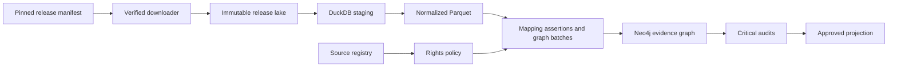
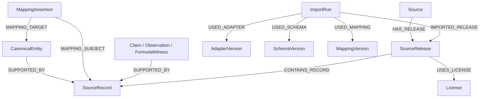

# Alchemy knowledge graph architecture

## Boundary

Neo4j is the only persistent operational database. The release lake is an immutable, local or
object-store-compatible evidence layer used by offline ingestion. DuckDB and Parquet are
rebuildable staging and exchange formats, not application databases. FastAPI's public contract is
unchanged by this foundation.

The pipeline is deterministic and offline after acquisition. End-user routes never download
source data. Network access is explicit in `alchemy downloads fetch`, uses only manifest URLs, and
does not send graph content or user data.

## Evidence and canonical layers

The graph separates four concerns:

1. `SourceRecord` preserves a release-owned record and original strings.
2. `Claim`, observation, and formula-witness nodes preserve what a source actually asserted.
3. `MappingAssertion` records why a source record may resolve to a canonical entity.
4. `CanonicalEntity` nodes provide stable integration identities and regenerable projections.

Every production canonical entity must be reachable from a source record. Every source record must
be contained by a checksum-verified `SourceRelease`, which points to a `Source`, `License`, and
`ImportRun`. A direct convenience relationship such as `IS_A` is a projection of sourced claim
nodes; deleting and rebuilding it does not destroy evidence.

`Claim` reifies a source-specific predicate, subject, object or literal value, qualification,
language, locator, evidence type, and review state. Conflicting claims coexist. A search/display
property derived from accepted claims is disposable.

A `FormulaConcept` is distinct from every `FormulaWitness`. A witness represents one text, edition,
dataset row, or historical variant and owns ordered `IngredientUse` nodes. Each ingredient use
preserves its source amount, unit text, preparation, role only when explicitly supplied, and
locator. Prepared materials remain separate canonical entities.

### Multilingual names

Names are modeled independently from entity identity. A canonical herb/material or formula can own
multiple `CanonicalName` nodes through `HAS_NAME`, with language, script, name kind, review status,
derivation method, source, and optional source-record evidence. The public projection may choose one
English display name without changing the exact Traditional Chinese source title or the entity ID.

The Taiwan MOHW foundation uses `taiwan-mohw-multilingual-names-v1`:

- English is the preferred public display/search name.
- tone-marked Hanyu Pinyin is a secondary romanized name; untoned Pinyin remains a search form;
- Traditional Chinese is the exact source-preferred name;
- 355 monograph English common names come from the official Taiwan Herbal Pharmacopeia index;
- formula and formula-only material English translations are marked as Current Flow derived,
  machine-imported names pending domain review rather than represented as official source titles.

This boundary permits future reviewed aliases and cross-source identity mappings without rewriting
source records or collapsing exact ingredient wording.

Scientific evidence uses `CompoundOccurrence`, `BioactivityObservation`, `ToxicityObservation`, and
`ExposureObservation` nodes so value, operator, unit, assay/specimen/route, time, geography, and
source context cannot disappear into an edge. `Prediction` is a separate label with model/training
metadata and is never counted as measured evidence.

## Stable identity

Application IDs are deterministic strings; Neo4j internal IDs are never exposed or persisted in
relationships. Release records include source and release identity. Canonical IDs derive only from
accepted namespaces or deterministic locally governed keys. Relationship IDs are stable over
re-runs, so batched `MERGE` writes are idempotent.

## Loading and scale

Adapters export node and relationship batches as JSON and Parquet. The Neo4j loader groups
allowlisted labels and relationship types, then uses parameterized `UNWIND` batches. The default
works on Community Edition without APOC. The Parquet export is also suitable for a future
administrative bulk-import path.

Indexes prioritize stable IDs, source/release lookups, review/rights status, namespaces/InChIKeys,
taxon IDs, publication IDs, and formula/material names. Full-text search is available for governed
names and rights-approved text. At larger scale, release partitions and Parquet exports allow
parallel transformation and administrative bulk loading without changing evidence semantics.

Migrations `003` through `005` add knowledge-layer uniqueness constraints, lookup/full-text
indexes, and projection metadata. Vector indexes remain deliberately unconfigured until an
embedding model, dimensions, rights policy, and reproducibility contract are accepted.

## Projection safety

Production eligibility is deny-by-default and inherited at row level. Projection rebuilding stops
when a critical graph audit fails. The rebuild recomputes eligibility for source records and
canonical entities, then records the projection version and build time in `GraphProjection`.
Synthetic, pending, blocked, failed-checksum, schema-drift, and unresolved-reject data cannot enter
the production-approved projection.

## Failure model

Acquisition is resumable and atomic. Each completed pipeline phase writes a checkpoint. Raw files
are immutable; normalized data and graph exports can be rebuilt. Reports capture schema, counts,
nulls, duplicates, rejects, unresolved mappings, rights, load results, and audits. A failure leaves
the last valid phase intact and never silently marks the release approved.
