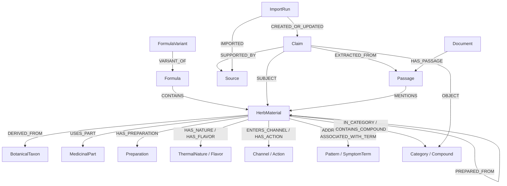

# Alchemy graph schema

## Identity and provenance

Every node uses a stable application ID. APIs and relationships never depend on Neo4j internal IDs.
Text similarity can propose a reviewable crosswalk but may not automatically merge medicinal
materials, taxa, preparations, or formulas. Original source names and quotations remain preserved.

Canonical search properties such as `display_name` and `aliases_search` are conveniences. A
source-specific `Claim` plus `SUPPORTED_BY` citation remains the authoritative representation of a
reported fact. Accepted, alternative, disputed, and superseded claims can coexist.

## Node labels

| Label                                            | Purpose                                                              |
| ------------------------------------------------ | -------------------------------------------------------------------- |
| `HerbMaterial`                                   | A traditional medicinal material                                     |
| `BotanicalTaxon`                                 | Biological taxonomy; not automatically a medicinal material          |
| `MedicinalPart`                                  | Root, rhizome, bark, seed, mineral, animal material, or similar part |
| `Preparation`                                    | Processing method or prepared form                                   |
| `Formula` / `FormulaVariant`                     | Named composition and explicitly sourced variant                     |
| `Compound`                                       | Chemical identity with external IDs                                  |
| `Action`, `Pattern`, `SymptomTerm`               | Source vocabulary; a symptom term is never a Current diagnosis       |
| `Channel`, `Flavor`, `ThermalNature`, `Category` | Source-reported classifications                                      |
| `Source`, `Claim`                                | Publication/dataset identity and its source-specific assertion       |
| `Document`, `Passage`                            | Rights-approved text and citation-addressable chunk                  |
| `ImportRun`                                      | One idempotent ingestion operation                                   |
| `AlchemyMigration`                               | Applied graph-schema migration checksum                              |

## Relationship map

The implementation allowlists the complete relationship vocabulary in
`domain/common/exploration.py`. Interaction edges preserve relationship type, directionality,
context, evidence/review status, uncertainty, source claim IDs, and any explicitly supplied
preparation or dose dependence. Missing edges mean unknown, never compatible.

## Formula composition

`Formula-[:CONTAINS]->HerbMaterial` can store amount, unit, preparation text, sequence, explicitly
supplied traditional role, and source-record ID. A Jun/Chen/Zuo/Shi role is not inferred. A prepared
material can have its own `HerbMaterial` ID plus a stable `base_material_id`; this lets analysis
recognize the same base material across distinct preparations without collapsing the records.

A `FormulaVariant` remains independently citable and points to its base formula with `VARIANT_OF`.
It is not represented as an unsourced overwrite of the base composition.

## Constraints and indexes

Versioned idempotent migrations create uniqueness constraints for every stable-ID label; property
indexes for source, claim, import, and review fields; and full-text indexes for herb names, formula
names, and Document/Passage text. Migration nodes store file IDs and SHA-256 checksums so an applied
migration cannot be silently rewritten. Static schema identifiers are migration-controlled; all
data values are parameters. APOC is not required.
