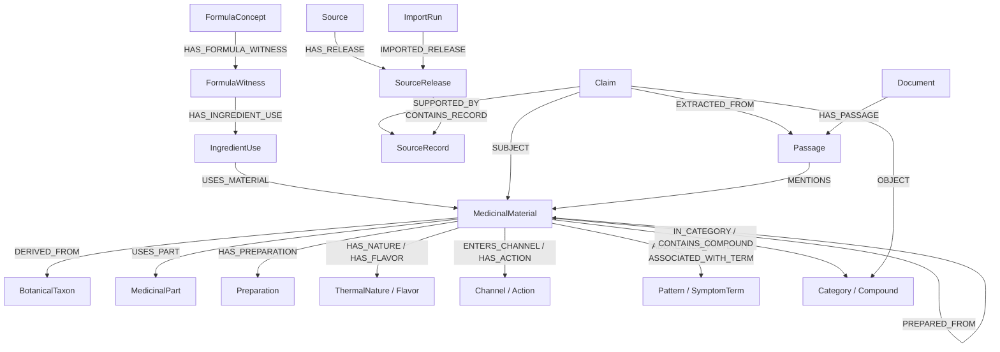

# Alchemy graph schema

## Identity and provenance

Every node uses a stable application ID. APIs and relationships never depend on Neo4j internal IDs.
Text similarity can propose a reviewable crosswalk but may not automatically merge medicinal
materials, taxa, preparations, or formulas. Original source names and quotations remain preserved.

Canonical search properties such as `display_name` and `aliases_search` are conveniences. A
source-specific `Claim` plus `SUPPORTED_BY` citation remains the authoritative representation of a
reported fact. Accepted, alternative, disputed, and superseded claims can coexist.

## Node labels

| Label                                            | Purpose                                                              |
| ------------------------------------------------ | -------------------------------------------------------------------- |
| `MedicinalMaterial` / `HerbMaterial`             | A traditional medicinal material; legacy `HerbMaterial` remains API-compatible |
| `BotanicalTaxon`                                 | Biological taxonomy; not automatically a medicinal material          |
| `MedicinalPart`                                  | Root, rhizome, bark, seed, mineral, animal material, or similar part |
| `Preparation` / `PreparedMaterial`               | Processing method and distinct material-preparation identity         |
| `FormulaConcept`                                 | Canonical named formula identity, never an unsourced composition      |
| `FormulaWitness` / `IngredientUse`               | Source-attested formula variant and its reified ingredients           |
| `Compound`                                       | Chemical identity with external IDs                                  |
| `DiseaseConcept` / `Condition`                   | Governed condition identity and source-resolved disease concept       |
| `Action`, `Pattern`, `SymptomTerm`               | Source vocabulary; a symptom term is never a Current diagnosis       |
| `Channel`, `Flavor`, `ThermalNature`, `Category` | Source-reported classifications                                      |
| `Source`, `SourceRelease`, `SourceRecord`        | Dataset identity, immutable release, and preserved release record     |
| `Claim`, observation types, `Prediction`         | Sourced assertions; predictions remain separate from measurements     |
| `MappingAssertion`                               | Versioned and reviewable source-to-canonical identity decision         |
| `Document`, `Passage`                            | Rights-approved text and citation-addressable chunk                  |
| `ImportRun`, version labels                      | One idempotent operation and its adapter/schema/mapping versions      |
| `AlchemyMigration`                               | Applied graph-schema migration checksum                              |

## Relationship map

The implementation allowlists the complete relationship vocabulary in
`domain/common/exploration.py`. Interaction edges preserve relationship type, directionality,
context, evidence/review status, uncertainty, source claim IDs, and any explicitly supplied
preparation or dose dependence. Missing edges mean unknown, never compatible.

## Formula composition

Composition is never stored as an authoritative direct edge from a formula concept. A
`FormulaWitness` preserves one source's named formula or variant and points to reified
`IngredientUse` nodes. Each ingredient use can retain amount, unit, preparation text, sequence,
explicitly supplied traditional role, and source-record evidence. A Jun/Chen/Zuo/Shi role is not
inferred. A `PreparedMaterial` has a distinct identity and can point to its base material without
collapsing the preparation.

For API search and workbench loading, an audited projection may add regenerable `CONTAINS` edges
and ordered `ingredient_ids`, `ingredient_amount_texts`, and `ingredient_units` properties to the
dual-labeled `Formula:FormulaConcept`. Those conveniences point to dual-labeled
`HerbMaterial:MedicinalMaterial` nodes but do not replace the witness → ingredient-use → material
evidence path.

## Constraints and indexes

Versioned idempotent migrations create stable-ID constraints, property indexes for provenance,
identity, review, and measurement fields, and full-text indexes for material, formula, taxon,
compound, disease, Document, and Passage text. Migration nodes store file IDs and SHA-256 checksums
so an applied migration cannot be silently rewritten. Static schema identifiers are
migration-controlled; all data values are parameters. APOC is not required. Vector indexes are
reserved until a reproducible embedding contract is accepted.

The full evidence-layer and release architecture is in
[`ALCHEMY_GRAPH_ARCHITECTURE.md`](ALCHEMY_GRAPH_ARCHITECTURE.md), and field definitions are in
[`ALCHEMY_DATA_DICTIONARY.md`](ALCHEMY_DATA_DICTIONARY.md).
